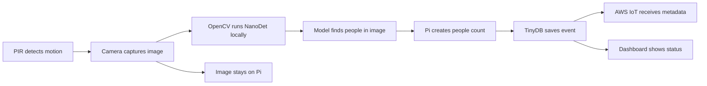

# IoT++ Smart Room Occupancy Monitor

A Raspberry Pi 5 uses an HC-SR501 PIR sensor to trigger a camera only when
motion occurs. The Pi then runs local person detection, saves the event in
TinyDB, publishes JSON metadata to AWS IoT Core, and displays recent events on a
local dashboard. Images stay on the Pi.



## Current status

| Component | Status | Evidence |
|---|---|---|
| Raspberry Pi software | Working | Python environment and required Pi/project packages load |
| Person detector | Working with test images | NanoDet counted two people in a person image and zero in a no-person image |
| TinyDB and MQTT outbox | Working | Events survive connection failure and restart; storage stress test retained every event |
| AWS IoT Core | Working | TLS connects; 12/12 QoS 1 soak messages were acknowledged |
| Dashboard | Working | HTML and JSON endpoints respond on port 5000 |
| CSI camera | Needs physical correction | `rpicam-hello --list-cameras` reports `No cameras available!` |
| HC-SR501 PIR | Needs physical correction | GPIO17 works, but no HIGH signal reached it during motion tests |
| Automated tests | Passing | 21/21 tests pass |

The software and AWS paths are ready. A complete real room event still depends
on correcting the camera connection and PIR signal. Detailed hardware evidence
is in [docs/pi-bringup-status.md](docs/pi-bringup-status.md).

Production mode uses real hardware data only. It does not create simulated
motion, images, or person counts.

## TinyDB and image storage

| Data | Location | Purpose |
|---|---|---|
| Captured JPEG | `images/<event_id>.jpg` | Actual local photograph |
| Event database | `data/events.json` | Motion, image path, detection result, time, and publish state |
| Model | `models/object_detection_nanodet_2022nov.onnx` | Local person detection |

On this Pi, images are stored under `/home/iot/iot-project/images/`. TinyDB
stores the path, not the image bytes. Images are ignored by Git and are not
uploaded through MQTT.

```json
{
  "event": {
    "device_id": "room-monitor-pi",
    "event_id": "<uuid>",
    "timestamp": "<UTC timestamp>",
    "motion": true,
    "pir_gpio": 17,
    "image_path": "images/<uuid>.jpg",
    "people_count": 1,
    "person_confidences": [0.82],
    "inference_ms": 120.4,
    "inference_backend": "nanodet"
  },
  "published": false
}
```

The values above show the schema only. Database and JPEG writes use atomic
replacement so incomplete writes do not replace the last valid file.

## Person detection

**High-level summary:** We chose a lightweight, pretrained NanoDet model and
stored it locally on the Raspberry Pi. OpenCV runs the deep neural network and
all of its calculations directly on the Pi's ARM CPU. The model examines the
camera image, distinguishes people from other objects, and returns the person
detections that the application counts. The image does not need to be sent to a
cloud AI service.

The model is stored as an **ONNX** file. ONNX, or Open Neural Network Exchange,
is a standard format for saving a trained neural network so software such as
OpenCV can run it without needing the original training framework. The ONNX
file contains the model structure and learned weights used for inference.

NanoDet is an object-detection model, not a language model. It predicts an
object class, confidence score, and location box for each object it sees. The
upstream model learned 80 COCO object classes; this project keeps only the
`person` class and counts the remaining person boxes.

| Item | Implementation |
|---|---|
| Model | NanoDet-m-plus-1.5x from [OpenCV Zoo](https://github.com/opencv/opencv_zoo/tree/main/models/object_detection_nanodet) |
| Training | Pretrained upstream on COCO; this project does not train new weights |
| Architecture | Lightweight one-stage, anchor-free object detector |
| Input | One camera image, letterboxed to 416 x 416 |
| Runtime | OpenCV DNN on the Raspberry Pi CPU |
| Filter | COCO `person` class above `PERSON_CONFIDENCE_THRESHOLD` |
| Output | Person count, confidence values, inference time, and backend name |
| Model size | About 3.8 MB; downloaded separately and SHA-256 verified |

NanoDet was chosen because its small ONNX file runs through OpenCV DNN directly
on the Pi's ARM CPU. It avoids a large PyTorch installation, an AI accelerator,
and cloud image processing. This keeps installation, inference, and the privacy
story simple while still providing object detection rather than basic whole-
image classification.

For each image, OpenCV preserves the aspect ratio while fitting it into a
416 x 416 canvas, normalizes the pixels, and runs the ONNX network. The network
returns class scores and bounding-box distances at four image scales. The code
decodes those values, keeps COCO class 0 (`person`) above the configured
threshold, and applies non-maximum suppression so overlapping predictions of
the same person are counted once. The number of remaining boxes becomes
`people_count`; their scores and total processing time are stored with it.

The detector does not identify faces or people. It averaged about 119.7 ms per
image during a 500-call Pi test. Continuous inference reached the Pi's thermal
limit, so running it only after PIR motion is a better fit for this project.

```bash
.venv/bin/python scripts/download_model.py
.venv/bin/python scripts/inference_test.py /path/to/image.jpg
```

## AWS IoT

| Topic | Purpose |
|---|---|
| `iot/setup/test` | Connection, subscription, publish, and return-message test |
| `iot/room/events` | Actual occupancy-event metadata |

The Pi authenticates as AWS IoT Thing `room-monitor-pi` with an X.509 device
certificate over MQTT/TLS port 8883. MQTT contains metadata, not the JPEG.

```bash
.venv/bin/python scripts/mqtt_test.py
.venv/bin/python scripts/outbox_test.py
```

See [docs/aws-setup.md](docs/aws-setup.md) for provisioning details.

## Run the project

```bash
cd ~/iot-project
python3 -m venv --system-site-packages .venv
.venv/bin/python -m pip install -r requirements-pi.txt
cp .env.example .env
.venv/bin/python scripts/download_model.py
```

Set `INFERENCE_BACKEND=nanodet` in `.env`, then use:

```bash
# Real hardware checks
.venv/bin/python scripts/hardware_test.py camera
.venv/bin/python scripts/hardware_test.py pir --timeout 120

# One local PIR-triggered event
.venv/bin/python -m src.main --local-only --count 1

# AWS-enabled monitor
.venv/bin/python -m src.main

# Dashboard, in another terminal
.venv/bin/python -m src.dashboard
```

| Interface | Address |
|---|---|
| Dashboard | `http://raspberrypi.local:5000/` |
| JSON | `/api/status` and `/api/events` |

## Main files

| File | Responsibility |
|---|---|
| `src/main.py` | PIR-triggered capture, inference, TinyDB persistence, and MQTT retry |
| `src/pir.py` | Real HC-SR501 input on BCM GPIO17 |
| `src/camera.py` | Picamera2 capture and atomic JPEG saving |
| `src/inference.py` | NanoDet person detection and timing |
| `src/database.py` | TinyDB history and durable MQTT outbox |
| `src/mqtt_client.py` | AWS IoT TLS connection and QoS 1 publishing |
| `src/dashboard.py` | Local status page and JSON API |
| `scripts/hardware_test.py` | Real camera and PIR checks |

## Verification

```bash
.venv/bin/python -m compileall -q src scripts tests
.venv/bin/python -m unittest discover -s tests -v
```

## Remaining work

| Priority | Task | Completion check |
|---:|---|---|
| 1 | Correct the CSI camera connection | Camera enumerates and saves a nonempty JPEG |
| 2 | Correct the PIR power/signal connection | GPIO17 records a real rising edge |
| 3 | Run one complete physical event | PIR -> JPEG -> count -> TinyDB -> AWS -> dashboard |
| 4 | Test real room scenes | Record useful counts and choose a confidence threshold |
| 5 | Compare triggered and continuous inference | Record inference count, latency, CPU use, and temperature |

## Files kept out of Git

`.gitignore` excludes `.env`, `.env.aws`, `.venv/`, `certs/`, generated images,
TinyDB runtime data, downloaded models, and Python caches. Never commit the AWS
device private key or certificate.
